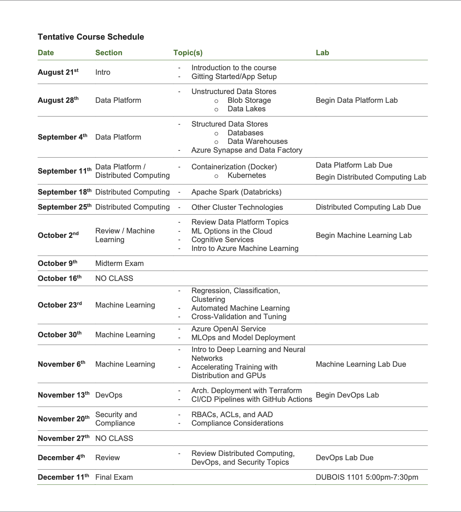

# DSBA6190

## Syllabus
[6190](HK/DSBA-6190_Syllabus_Fall2024.pdf)

## Schedule

## Services and Software
Here are some services and software that we will use throughout the semester:

GitHub:
- Create an account: [Link](https://github.com/signupLinks) to an external site.
- GitHub Desktop: [Link](https://github.com/apps/desktopLinks) to an external site.
- Azure:
- Portal: [Link](https://portal.azure.com/Links) to an external site.
- Azure CLI: [Link](https://learn.microsoft.com/en-us/cli/azure/install-azure-cliLinks) to an external site.
- Azure Storage Python SDK: [Link](https://learn.microsoft.com/en-us/azure/storage/blobs/storage-quickstart-blobs-pythonLinks) to an external site.
- Azure Machine Learning Python SDK: [Link](https://learn.microsoft.com/en-us/python/api/overview/azure/ml/installLinks) to an external site.

Docker and Kubernetes:
- Docker Desktop: [Link](https://www.docker.com/products/docker-desktop/Links) to an external site.
- WSL2 on Windows: [Link](https://learn.microsoft.com/en-us/windows/wsl/installLinks) to an external site.
- Kubernetes Python SDK: [Link](https://github.com/kubernetes-client/python/Links) to an external site.
- Kubernetes CLI (kubectl): [Link](https://kubernetes.io/docs/tasks/tools/#kubectlLinks) to an external site.

Free stuff (not required for this class):
- GitHub for Students: [Link](https://education.github.com/packLinks) to an external site.
- Azure for Students: [Link](https://azure.microsoft.com/en-us/free/studentsLinks) to an external site.
- Tableau for Students: [Link](https://www.tableau.com/academic/studentsLinks )to an external site.

- O'Reilly Books:
- Learning Microsoft Azure: [Link](https://www.oreilly.com/library/view/learning-microsoft-azure/9781098113315/Links) to an external site.
- Cloud Native Infrastructure with Azure:[Link](https://www.oreilly.com/library/view/cloud-native-infrastructure/9781492090953/Links) to an external site.
- Data Science at the Command Line: [Link](https://www.oreilly.com/library/view/data-science-at/9781492087908/Links) to an external site.
- Artificial Intelligence with Microsoft Power BI: [Link](https://www.oreilly.com/library/view/artificial-intelligence-with/9781098112745/Links) to an external site.
- Genomics in the Azure Cloud: [Link](https://www.oreilly.com/library/view/genomics-in-the/9781098139032/Links) to an external site.

Others:
- Interpretable Machine Learning: [Link](https://christophmolnar.com/books/interpretable-machine-learning/Links) to an external site.
